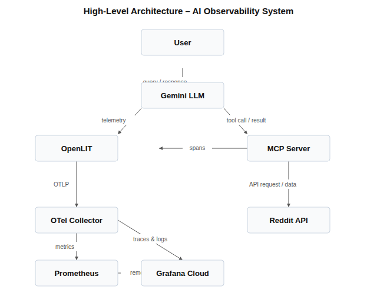

## 1. Introduction

In this project, we design an AI system with full observability for monitoring both the behavior of a Large Language Model (LLM) and its interactions with external tools.

The system is hosted on AWS and uses OpenLIT as the core observability platform. Through OpenLIT, we monitor conversations handled by the Gemini LLM. The model is extended with tool-calling capabilities via an MCP (Model Context Protocol) server, which enables it to retrieve additional information from external sources—in this case, Reddit.

To ensure complete visibility into the system, we integrate Grafana Cloud for monitoring and visualization. This allows us to track not only the LLM's internal performance (such as latency and token usage), but also its interactions with the MCP server and external APIs.

The goal of this setup is to provide end-to-end observability of an AI application, making it easier to debug, optimize, and understand how the model behaves in real-world scenarios.

---

## 2. Theoretical Background / Technology Stack

The proposed solution combines modern LLM orchestration with observability practices typically used in distributed systems.

**Large Language Model (LLM):**  
The system uses Gemini as the primary LLM responsible for generating responses. The model processes user input and, when needed, retrieves external data via tools.

**Model Context Protocol (MCP) Server:**  
The MCP server acts as an intermediary layer between the LLM and external data sources. It enables tool usage by the LLM—in this case, querying Reddit. This introduces additional complexity and requires visibility into tool calls, latency, and response quality.

**OpenLIT (hosted on AWS):**  
OpenLIT is used for LLM observability. It captures:
- Prompts and responses
- Token usage
- Latency metrics
- Tool invocation traces (via MCP)

Running OpenLIT on AWS ensures scalability, reliability, and integration with cloud-native monitoring practices.

**Observability Stack:**
- OpenTelemetry: Standard for collecting traces, metrics, and logs across distributed systems.
- Prometheus: Used for scraping and storing time-series metrics such as request latency, token counts, and error rates.

**Visualization Layer:**
- Grafana Cloud: Provides dashboards and alerting capabilities. It visualizes:
  - LLM performance metrics
  - MCP tool usage
  - End-to-end request traces
  - System health indicators

This stack enables full observability across the AI pipeline—from user query to external data retrieval and final response generation.

---

## 3. Case Study Concept Description (Application / Observability / Visualization)

**Application Layer:**  
The application consists of a conversational interface powered by Gemini. When a user submits a query:
1. The LLM processes the request.
2. If external knowledge is needed, it invokes the MCP server.
3. The MCP server queries Reddit and returns relevant data.
4. The LLM incorporates this data into the final response.

**Observability Layer:**  
Observability is implemented using OpenLIT and OpenTelemetry instrumentation:
- Every interaction (prompt -> response) is logged.
- MCP calls are traced as separate spans in a distributed trace.
- Metrics such as latency, token usage, and error rates are collected.
- Logs provide detailed debugging information for failures or unexpected outputs.

Key observability goals:
- Understand LLM behavior and performance
- Monitor tool usage (Reddit queries via MCP)
- Detect anomalies (e.g., slow responses, failed tool calls)
- Analyze cost drivers (token consumption)

**Visualization Layer:**  
Grafana Cloud aggregates and visualizes all collected data:
- Dashboards display real-time system performance
- Traces show the full lifecycle of a request (LLM -> MCP -> Reddit -> LLM)
- Alerts notify when thresholds are exceeded (e.g., high latency or error rates)

This enables both operational monitoring and deeper analysis of LLM behavior.

---

## 4. Case Study High-Level Architecture

The architecture follows a pipeline model with three main stages: LLM -> Observability -> Visualization.



**1. Interaction Layer (LLM):**
- User sends a query
- Gemini processes the input
- Optional: invokes MCP server for Reddit data

**2. Integration Layer (MCP Server):**
- Receives tool requests from the LLM
- Queries Reddit
- Returns structured data to the LLM

**3. Observability Layer:**
- OpenLIT captures:
  - Prompts/responses
  - Tool calls
  - Latency and token metrics
- OpenTelemetry instruments all components
- Prometheus stores metrics

**4. Visualization Layer:**
- Grafana Cloud connects to Prometheus and telemetry sources
- Displays dashboards for:
  - LLM performance
  - MCP usage
  - End-to-end traces

**Data Flow Summary:**
1. User -> LLM (Gemini)  
2. LLM -> MCP Server (if external data needed)  
3. MCP -> Reddit -> MCP -> LLM  
4. OpenLIT captures all steps  
5. Metrics/logs/traces -> Prometheus / OpenTelemetry  
6. Grafana Cloud visualizes and monitors the system  

This architecture ensures full transparency of the AI system, enabling debugging, optimization, and reliable production deployment.

## 5. Case study detailed architecture

This section describes the detailed technical architecture of the AI observability system. The system consists of four layers that together provide full end-to-end visibility of the LLM pipeline.

## 5.1 Overview

The architecture is based on a microservice approach hosted on AWS. Each component fulfils a specific role, and all components communicate via standardised protocols (HTTP/REST, gRPC, OpenTelemetry OTLP).

| Layer | Component | Role |
|---|---|---|
| Application | Gemini API (Google) | Primary LLM – generates responses |
| Integration | MCP Server (AWS EC2) | Tool broker – queries Reddit |
| Observability | OpenLIT (AWS EC2) | LLM telemetry collection |
| Observability | OpenTelemetry Collector | Aggregates traces, metrics, logs |
| Storage | Prometheus (AWS EC2) | Time-series metrics storage |
| Visualisation | Grafana Cloud | Dashboards, alerts, trace viewer |

## 5.2 Application Layer – Gemini + MCP

The application layer is the entry point for user requests. The client application (e.g. a Python script or web UI) sends a prompt to Gemini via the Google Generative AI SDK. Gemini is configured with access to a custom tool set exposed by the MCP server.

When Gemini determines that additional context is required – for example, current opinions or discussions from Reddit – it issues a structured tool call. This call is forwarded to the MCP server, which handles the external API interaction, and the result is returned to Gemini for incorporation into the final response.

Key design decisions:

- Gemini is accessed exclusively via API – no local model hosting is required.
- The MCP server runs as a lightweight FastAPI service on a single EC2 instance.
- Reddit queries use the PRAW (Python Reddit API Wrapper) library with OAuth2 authentication.

## 5.3 Observability Layer – OpenLIT & OpenTelemetry

OpenLIT is deployed as a Docker container on a dedicated EC2 instance. It auto-instruments the Gemini SDK calls using its Python SDK patch (`openlit.init()`), capturing:

- Every prompt sent to Gemini and every response received.
- Token counts (input tokens, output tokens, total cost estimate).
- Latency of each LLM call (wall-clock time from request to first token and to completion).
- MCP tool invocations – logged as child spans within the parent LLM trace.
- Error events – e.g. API timeouts, rate-limit errors, failed Reddit queries.

All telemetry is exported via the OpenTelemetry Protocol (OTLP) to an OpenTelemetry Collector running on the same host. The Collector applies filtering and batching, then forwards:

- **Traces** → Grafana Cloud Tempo (distributed tracing backend)
- **Metrics** → Prometheus via a `remote_write` endpoint
- **Logs** → Grafana Cloud Loki (log aggregation backend)

## 5.4 Storage Layer – Prometheus

Prometheus scrapes metrics from the OpenTelemetry Collector every 15 seconds. The following metric families are stored:

| Metric name | Type | Description |
|---|---|---|
| `llm_request_duration_seconds` | Histogram | End-to-end LLM call latency |
| `llm_token_usage_total` | Counter | Cumulative token consumption |
| `mcp_tool_calls_total` | Counter | Number of MCP tool invocations |
| `mcp_tool_duration_seconds` | Histogram | Reddit query latency via MCP |
| `llm_errors_total` | Counter | Count of failed LLM or tool calls |

Prometheus data is retained locally for 30 days and forwarded to Grafana Cloud via `remote_write` for long-term retention and centralised access.

## 5.5 Visualisation Layer – Grafana Cloud

Grafana Cloud connects to three data sources: Prometheus (metrics), Tempo (traces), and Loki (logs). The following dashboards are provided:

- **LLM Performance Dashboard** – request rate, p50/p95/p99 latency, token usage trends, error rate.
- **MCP Tool Usage Dashboard** – call frequency per tool, Reddit query success rate, tool latency distribution.
- **Cost Analysis Dashboard** – estimated API cost per hour/day based on token counters.
- **Trace Explorer** – full end-to-end trace view: User → Gemini → MCP → Reddit → Gemini → User.

---

# 6. Environment Configuration Description

This section describes all environment variables, configuration files, and infrastructure settings required to run the system.

## 6.1 AWS Infrastructure

The following EC2 instances are used (all in the same VPC and availability zone to minimise inter-service latency):

| Instance | Type | OS | Services hosted |
|---|---|---|---|
| app-server | t3.small | Ubuntu 22.04 | Python app + MCP server |
| observability-server | t3.medium | Ubuntu 22.04 | OpenLIT, OTel Collector, Prometheus |

## 6.2 Application Environment Variables

The following environment variables must be set on the `app-server` instance. They can be placed in a `.env` file loaded by `python-dotenv`, or exported directly in the shell.

| Variable | Example value | Description |
|---|---|---|
| `GEMINI_API_KEY` | `AIza...` | Google AI Studio API key |
| `MCP_SERVER_URL` | `http://localhost:8000` | Base URL of the MCP server |
| `REDDIT_CLIENT_ID` | `abc123` | Reddit OAuth2 client ID |
| `REDDIT_CLIENT_SECRET` | `secret456` | Reddit OAuth2 client secret |
| `REDDIT_USER_AGENT` | `llm-obs-bot/1.0` | User-agent string for Reddit API |
| `OTEL_EXPORTER_OTLP_ENDPOINT` | `http://<obs-ip>:4318` | OpenTelemetry Collector endpoint |

## 6.3 OpenLIT Configuration

OpenLIT is initialised programmatically inside the Python application using its SDK:

```python
import openlit

openlit.init(
    otlp_endpoint="http://<observability-server-ip>:4318",
    application_name="llm-reddit-bot",
    environment="production"
)
```

OpenLIT automatically patches the Google Generative AI SDK upon initialisation. No manual instrumentation of individual API calls is required.

## 6.4 OpenTelemetry Collector Configuration

The OpenTelemetry Collector is configured via `otel-collector-config.yaml`. Key sections:

- **Receivers:** `otlp` (gRPC on `:4317`, HTTP on `:4318`) to accept telemetry from OpenLIT.
- **Processors:** `batch` (max 512 spans, timeout 5 s) and `memory_limiter` (max 512 MiB) to prevent OOM.
- **Exporters:** `prometheusremotewrite` to Prometheus on `localhost:9090`, `otlphttp/tempo` to Grafana Cloud Tempo, `loki` to Grafana Cloud Loki.
- **Pipelines:** traces pipeline (otlp → batch → tempo), metrics pipeline (otlp → batch → prometheus), logs pipeline (otlp → batch → loki).

## 6.5 Prometheus Configuration

Prometheus is configured to scrape itself and accept `remote_write` from the OTel Collector. The `prometheus.yml` file includes:

- `global.scrape_interval: 15s` – default scrape frequency.
- `scrape_configs` – scrape job for the OTel Collector's Prometheus exporter endpoint (`:8889`).
- `remote_write` – endpoint pointing to Grafana Cloud Prometheus (with Basic Auth credentials).

## 6.6 Grafana Cloud Connection

Grafana Cloud requires three data source connections configured in the UI:

- **Prometheus** – URL: remote_write endpoint of the Grafana Cloud Prometheus stack; auth: Basic Auth (username = stack ID, password = API token).
- **Tempo** – URL: Grafana Cloud Tempo endpoint; auth: same API token.
- **Loki** – URL: Grafana Cloud Loki endpoint; auth: same API token.

All API tokens are scoped with `MetricsPublisher`, `TracesPublisher`, and `LogsPublisher` permissions. Tokens are stored as environment variables on the `observability-server` and referenced in the OTel Collector YAML – they are never committed to source control.

---

# 7. Installation Method

High-level installation guide for the complete stack. The setup is still in an early stage — steps and configurations will be refined as implementation progresses. All commands target Ubuntu 22.04.

## 7.1 Prerequisites

- Two AWS EC2 instances provisioned (see Section 6.1 for specs).
- A Google AI Studio account with a valid Gemini API key.
- A Reddit application registered at `reddit.com/prefs/apps` (type: script).
- A Grafana Cloud account (free tier is sufficient).
- Docker and Docker Compose installed on both EC2 instances.

## 7.2 Clone the Repository

On both EC2 instances:

```bash
git clone https://github.com/SzymonWojturski/AI-O.git
cd AI-O
```

## 7.3 Set Up the Observability Server

1. Start OpenLIT via Docker Compose from the `openlit/` directory.
2. Deploy the OpenTelemetry Collector using the provided config file — fill in Grafana Cloud credentials where indicated.
3. Deploy Prometheus using the provided config file — fill in the `remote_write` details for Grafana Cloud.

## 7.4  Set Up the Application Server

1. Install Python dependencies: `pip install -r requirements.txt`
2. Populate the `.env` file with the values described in Section 6.2.
3. Start the MCP server: `uvicorn mcp_server.main:app --host 0.0.0.0 --port 8000`

## 7.5 Configure Grafana Cloud Dashboards

1. Add Prometheus, Tempo, and Loki as data sources using the credentials from Section 6.6.
2. Import the dashboard and alert definitions from the `grafana/` directory.

## 7.6 Smoke Test

```bash
python scripts/smoke_test.py --query "What reddit reccomend to invest in polymarket?"
```

A successful run produces a Gemini response in the console, a new trace visible in OpenLIT, and updated metrics in Grafana. Detailed validation criteria will be defined as the implementation matures.

## 8. Demo deployment steps

## 9. Demo description

## 10. Summary – conclusions

## 11. References
